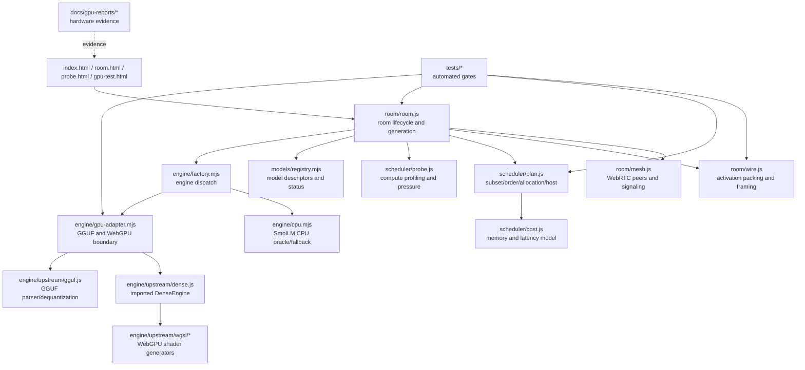
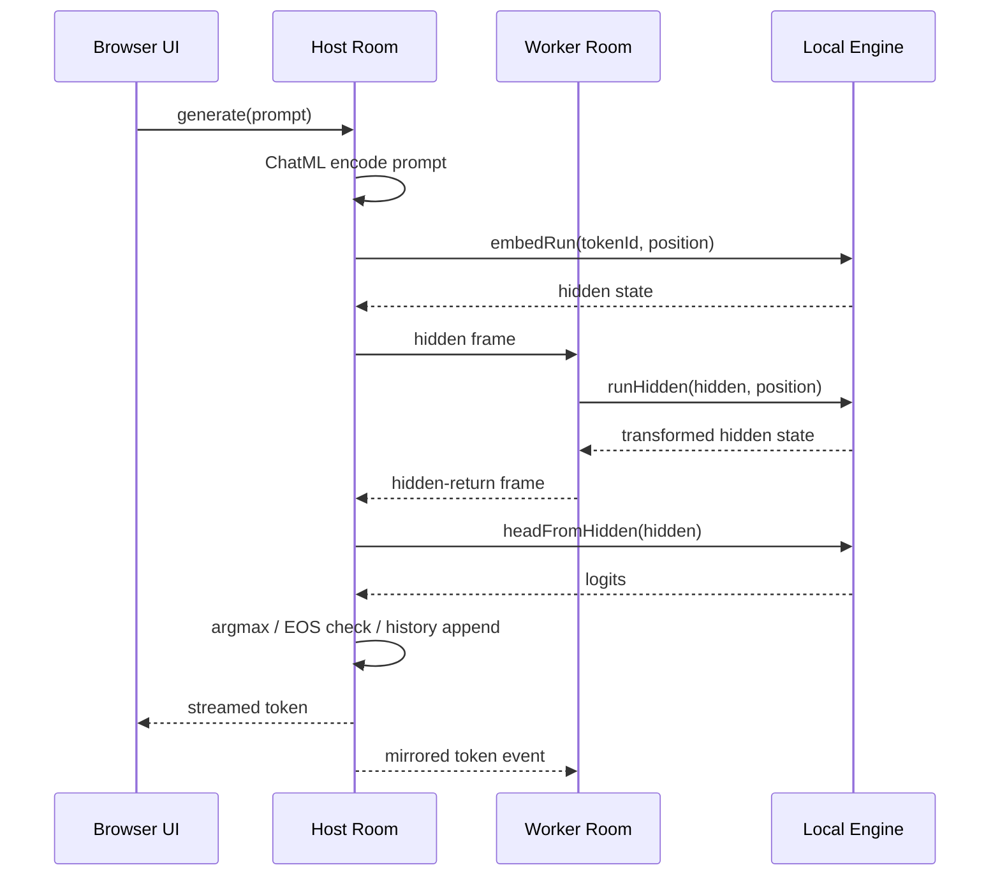
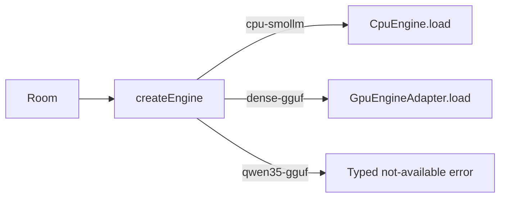
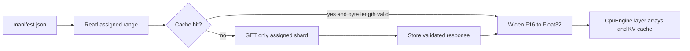
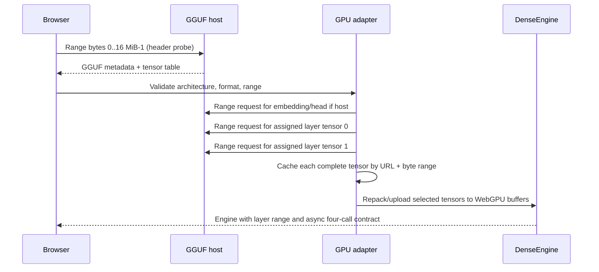

# AI Swarm — Complete Project Record, Current Scope, and Roadmap

**Document date:** 2026-09-10  
**Repository:** `E:\\swarmllm`  
**Current verified test count:** 183 automated tests, all passing  
**Current practical milestone:** live two-tab Qwen3 0.6B Q8_0 WebGPU split with recovery  
**Next product gate:** prove the same flow on two separate physical devices

This is the consolidated technical record for the project. It describes what the
repository actually contains, how a room runs a model, what has been demonstrated,
what is still bounded or unproven, and the implementation sequence for the remaining
model ladder. It should be read together with the source code and the dated JSON
reports in `docs/gpu-reports/`.

The current code is the authority when an older README sentence and a newer report
disagree. Several README/checklist paragraphs were written before the Qwen3 integration
was completed and still describe the earlier CPU-only milestone. The current code,
`IMPLEMENTATION_PLAN.md`, and the 2026-09-10 reports record the newer state.

---

## 1. The product in one paragraph

AI Swarm turns a group of ordinary browsers into one pipeline-parallel language-model
runtime. One browser creates a room and shows a short code or join link. Other phones,
laptops, or desktops join without installing an application or creating an account.
Each browser reports its measured compute speed, a user-selected **soft capacity
budget**, browser/GPU capabilities, and peer-to-peer link timings. The host planner
chooses which devices are worth using, elects the host, orders the selected devices
into a chain, and assigns each one a contiguous half-open layer range such as `[0, 14)`
or `[14, 28)`.

Each selected device downloads only the tensors needed for its assigned range (plus
host-only tensors when it is the host), executes its layers locally, and sends a small
hidden-state activation to the next device over a direct WebRTC data channel. The last
stage returns the hidden state to the host. The host performs the final normalization,
LM head, greedy sampling, and broadcasts the streamed answer to every screen. If a
worker leaves, the host fails the current lap, re-plans over the survivors, reloads or
reuses ranges, replays the conversation to rebuild KV caches, and retries the token.

The project is therefore a **distributed inference pipeline**, not a collection of
independent chatbots and not a cloud inference API.

---

## 2. Intended user experience

The target flow is:

```mermaid
flowchart LR
    A[Host opens room.html] --> B[Room code / join link / QR]
    B --> C[Other browsers join]
    C --> D[Each browser runs capability probe]
    D --> E[User chooses a soft GPU capacity budget]
    E --> F[Devices announce speed, budget, RTT, pressure]
    F --> G[Planner selects subset, host, order, and ranges]
    G --> H[Each device downloads only its assigned tensors]
    H --> I[WebGPU self-check and range load]
    I --> J[All selected stages report ready]
    J --> K[Chat prompt enters the host]
    K --> L[Hidden state traverses the WebRTC layer chain]
    L --> M[Host computes logits and samples]
    M --> N[Token is streamed to every browser]
    N --> K
    L --> O{Worker leaves?}
    O -- no --> M
    O -- yes --> P[Fail lap immediately]
    P --> Q[Re-plan and re-deal]
    Q --> R[Replay history and resume]
    R --> M
```



The UI is designed to show the important facts rather than hiding them:

- the chosen model and its verification status;
- each device's measured speed and pledged capacity;
- the selected chain and exact layer ranges;
- which devices were dropped and why;
- loading progress and cache status;
- predicted versus observed token rate and network lap time;
- recovery progress if a worker leaves;
- the same chat transcript and streamed tokens on all screens.

### 2.1 What “no server in the middle” means

The application still needs ordinary web infrastructure, but no service performs the
model inference:

| Service | Required for the browser demo? | What it sees | What it does not receive |
|---|---:|---|---|
| Static HTTPS host | Yes | Normal HTTP request metadata | Prompts and activation computation |
| WebSocket signaling broker | Yes for introductions | Room code, names, SDP/ICE, capability metadata | Prompts, hidden states, generated answers |
| STUN | Usually | NAT traversal metadata | Model computation |
| TURN | Only when direct P2P fails | Relayed encrypted WebRTC traffic and metadata | Plaintext inference payloads at the relay |
| Model host or local mirror | On first load | Range requests for public model bytes | Room prompts and answers |
| WebRTC peers | Yes | Activations and room messages for trusted participants | Nothing outside their direct room links |

After the WebRTC links are established, hidden states, control messages, and streamed
tokens travel over peer data channels. The signaling service is not in the inference
loop. This is meaningfully different from sending prompts to an inference API, but it
is not a malicious-peer privacy boundary: a worker can observe the activation tensors,
timings, and the shared conversation by design.

---

## 3. Current state at a glance

### 3.1 What is working and evidenced

| Area | Current state | Evidence |
|---|---|---|
| Room creation and joining | Working in `room.html` | `room/room.js`, `room/mesh.js`, QR/link UI |
| Direct peer links | WebRTC mesh with negotiated control and binary channels | `room/mesh.js`, wire tests, live room runs |
| Signaling | Introductions only; no prompt/activation message type | `tools/signal.mjs` |
| CPU fallback model | SmolLM2 135M, 30 layers, split-capable | `engine/cpu.mjs`, model shards, split/recovery tests |
| Dense WebGPU engine | Vendored `DenseEngine` with WGSL kernels | `engine/upstream/` and Phase 1 report |
| GPU adapter/factory | Real GGUF header parsing, range fetch, validation, caching, factory dispatch | `engine/gpu-adapter.mjs`, `engine/factory.mjs`, Phase 2 report |
| Qwen3 0.6B model | Local byte-verified Q8_0 GGUF, model-aware room path | `models/qwen3-0.6b/`, registry, Phase 3 report |
| Qwen3 split generation | 14+14 split proven in a live two-tab WebRTC room | Phase 3 golden and Phase A report |
| GPU worker recovery | Worker departure, re-plan, reload, replay, and continuation proven | Phase A report |
| External reference | 36 prompt token IDs and 12 greedy output IDs match Transformers | Phase B report |
| Generation length | Model-specific caps; Qwen default 320 tokens | registry and Phase D work |
| Planner | Exact dense subset/order/allocation/host search for small rooms | `scheduler/plan.js`, 29 planner tests |
| UI | Model selector, capacity slider, device/range plan, chat, recovery/status panels | `room.html` |
| Automated regression | 183 tests pass | `npm test` |

### 3.2 What is not yet complete

The biggest gap is not the basic distributed architecture. It is external validation and
scale:

1. The current Qwen proof used two browser peers on one physical AMD GCN-5 development
   GPU. A second physical laptop/phone has not yet been recorded as a passing Qwen
   participant.
2. The live recovery run exercises a worker disconnect. An actual WebGPU
   `device.lost` event during generation has not been induced; its error handling is
   unit-tested.
3. The Qwen tokenizer uses the repository's GPT-2-style pre-tokenizer regex. It matches
   the tested plain-English prompt, but it is not yet a general byte-exact port of
   Qwen's own pre-tokenizer for all digits, whitespace, and punctuation cases.
4. Qwen3 1.7B has now been fetched and passed the read-only GGUF/config preflight,
   but it has not yet passed the browser, split, recovery, or external-reference
   gates. Qwen3 4B remains a descriptor and has not been fetched.
5. Qwen 3.8 27B is a different hybrid architecture. Its Gated-DeltaNet engine and
   shaders are not imported, and the current planner still assumes uniform dense
   layers.
6. TURN fallback, cache-clearing UX, room diagnostics export, and production/demo
   hardening remain.

---

## 4. Repository architecture



### 4.1 `room/` — the distributed runtime

#### `room/room.js`

`Room` is the orchestration layer. It does not implement a model's matrix math. It
coordinates the model descriptor, device profiling, planner, load/deal protocol,
generation, mirrored UI events, and recovery.

Important state held by a room:

- `model`: registry key, initially `smollm2-135m` unless a link/model selection says
  otherwise;
- `mesh`: the direct peer graph;
- `engine`: this browser's local engine instance;
- `tok`: this browser's tokenizer;
- `isHost` and `hostId`: the host owns the transcript, tokenizer, embedding table, LM
  head, and sampler;
- `chain`: selected peer IDs in layer order;
- `range`: this browser's `[lo, hi)` layer range;
- `next`: the next peer to receive a hidden state;
- `spec`: scheduler model specification;
- `myProfile`: measured compute speed, budget, stability, thermal/pressure data;
- `rttMatrix`: peer-to-peer timing information;
- `history`: every successfully processed token ID, used for recovery replay;
- `turns`: user/assistant conversation records;
- `_deadPeers`: departed IDs checked before a send to avoid a full timeout;
- `recovering`/`busy`: guards that prevent nested recovery and overlapping generation.

The model-aware lifecycle is:

1. `_loadModelSpec()` resolves a registry descriptor.
2. CPU SmolLM reads `manifest.json`; dense GGUF models fetch and parse only the GGUF
   header and load the tokenizer.
3. `join()` connects to the mesh, chooses/accepts a soft budget, runs the synthetic
   profile, announces metadata, starts RTT gossip, and installs visibility/pressure
   watchers.
4. `start()` builds the current device list and solves a plan.
5. The elected host calls `_deal()` and sends each worker its model, range, next hop,
   and host ID.
6. Each device calls `_load()` through the engine factory, then calibrates the real
   loaded layers.
7. The host waits for workers, broadcasts `ready-all`, and accepts prompts.

The generation path is deliberately engine-agnostic:



`room.js` awaits all three engine operations. That matters because CPU execution is
synchronous internally but GPU dispatch/readback is asynchronous; one async contract
keeps the room from accidentally treating a Promise as a hidden-state array.

#### `room/mesh.js`

`Mesh` maintains a direct WebRTC connection to every room peer. Each link has two
negotiated data channels:

- control channel ID 1: JSON messages, metadata, RTT probes, deal/progress/ready/chat
  events;
- wire channel ID 77: binary hidden-state frames.

The newcomer always offers to existing members, while existing members answer. That
rule avoids SDP glare. STUN servers are configured, but TURN is not yet configured.
The signaling WebSocket only introduces peers and relays SDP/ICE.

#### `room/wire.js`

The wire layer does two jobs:

1. choose an activation precision that does not add an unnecessary SCTP send
   opportunity;
2. slice binary messages into approximately 4,600-byte frames.

The current choice is:

| Hidden width | f32 payload | f16 payload | Current choice | Reason |
|---:|---:|---:|---|---|
| SmolLM2 576 | 2,304 B | 1,152 B | f32 | both fit in one frame, so f32 preserves exact values |
| Qwen3 0.6B 1,024 | 4,096 B | 2,048 B | f32 | both fit in one frame, so f32 is latency-free and exact |
| Qwen3 1.7B 2,048 | 8,192 B | 4,096 B | f16 | f16 reduces two frames to one |
| Qwen 3.8 5,120 | 20,480 B | 10,240 B | f16 | neither fits one frame; f16 reduces total slices |

The decoder rejects malformed magic, tracks duplicate/out-of-order slices, limits
completed-message memory, drops stale partial reassemblies, and returns a typed hidden
frame only after all slices arrive. Non-finite hidden states are rejected before they
are forwarded.

#### `room/awake.js`, `room/qr.js`, and `room/markdown.js`

- `awake.js` requests a Screen Wake Lock while a device holds layers so a visible
  worker is less likely to be throttled or put to sleep.
- `qr.js` creates a compact room/join representation and is covered by QR tests.
- `markdown.js` renders streamed assistant text while guarding against unsafe markup;
  the Markdown suite includes injection cases.

### 4.2 `scheduler/` — the project-specific contribution

#### Model and memory cost (`scheduler/cost.js`)

The scheduler operates in milliseconds and bytes. For a dense model it derives:

- hidden size and KV dimension;
- per-layer MAC estimate;
- LM-head MAC estimate;
- weight bytes per layer;
- embedding bytes;
- KV-cache bytes per layer at the selected context length;
- activation bytes on the wire;
- scratch/logit buffer bytes;
- whether the output head is tied to embeddings.

Memory for a device is:

```text
layerCount × (layerBytes + kvBytesPerLayer)
+ host ? embedBytes : 0
+ scratchBytes
```

The host must fit the embedding table and at least one layer. A device's budget is a
user pledge, not a guaranteed VRAM reservation. The browser remains authoritative: if
the actual WebGPU allocation fails, the room must reduce usable capacity and re-plan.

#### Latency cost

For each chain hop:

```text
hopMs = RTT / 2 + serializedActivationBytes / linkBandwidth
```

For a concrete plan:

```text
tokenMs = sum(deviceLayers × deviceMsPerLayer)
        + sum(chainHopMs)
        + hostLMHeadOverhead
```

The LM head is charged to the host because it is serial and cannot be distributed by
the current protocol. Every additional device also adds a hop, so more devices can
make one-token decode slower. The swarm's first benefit is **capacity**, not automatic
speedup.

#### `scheduler/plan.js`

Five strategies are available through one interface:

| Strategy | Meaning |
|---|---|
| `solo` | fastest device that can hold the whole model |
| `even` | equal shares in join order |
| `memory` | shares proportional to pledged memory, exo-style baseline |
| `compute` | shares proportional to measured speed, network-blind baseline |
| `optimal` | exact subset + order + contiguous allocation + host search |

For small rooms the optimal solver:

1. enumerates feasible device subsets;
2. computes the minimum Hamiltonian cycle with Held–Karp;
3. rotates the cycle for every candidate host;
4. runs a contiguous-range dynamic program over layer cut points;
5. charges host LM-head overhead and hop cost;
6. retains the lowest predicted token latency;
7. explains host selection, dropped peers, chain order, and load imbalance.

Rooms above the exact-tour threshold use nearest-neighbour plus 2-opt so the UI cannot
freeze on a large room. Current dense allocation is exact for uniform per-layer costs.

The optional `weights` parameter in `allocate()` is intentionally documented as
**not wired for production**. Qwen 3.8 requires heterogeneous per-layer compute and
memory profiles; accepting a parameter alone does not make the hybrid scheduler ready.

#### `scheduler/probe.js`

The profile runs a large representative matvec after a time-based warm-up, takes the
median of several measurement windows, converts MAC/s to estimated milliseconds per
layer, and records spread/visibility. It also reads battery information where the
browser exposes it and watches Chromium CPU pressure. Visibility changes trigger a
re-measure because background browser tabs can be several times slower.

The capacity slider uses conservative defaults. It is a **soft planning cap**, not a
literal instruction to allocate that amount of GPU memory.

### 4.3 `engine/` — interchangeable local engines

#### The four-call engine contract

Every model engine must provide:

```js
await engine.embedRun(tokenId, position); // host embedding + owned layers
await engine.runHidden(hidden, position); // worker owned layers
await engine.headFromHidden(hidden);      // host final norm + LM head
engine.reset();                           // clear KV/recurrent state
```

The room additionally reads `layerCount`, `bytesLoaded`, `maxSeq`, and optional cache
information for the UI.

#### `engine/cpu.mjs`

The CPU engine is the original dense SmolLM path and an independent oracle:

- reads the local manifest and per-layer F16 shards;
- widens F16 weights to Float32 arrays;
- loads only `[lo, hi)` layer files;
- loads embeddings and final/head tensors only on the host;
- stores per-layer K/V caches for a 512-position default context;
- implements RMSNorm, grouped-query attention, RoPE, SiLU-gated MLP, and tied LM head;
- exposes the same async contract as the GPU engine;
- caches shard responses in the browser Cache API with byte-length validation.

SmolLM2 is small enough to be the dependable CPU fallback and the baseline for room,
split, and recovery tests.

#### `engine/factory.mjs`

The factory keeps `room.js` independent of implementation details:



The Qwen 3.8 error is deliberately architectural: its hybrid engine and scheduler are
not present. It is not presented as a URL or configuration problem.

#### `engine/gpu-adapter.mjs`

The adapter is locally owned glue around the imported DenseEngine. It provides:

1. classified WebGPU acquisition errors (`no-webgpu`, `no-adapter`, missing
   `shader-f16`, device errors);
2. explicit `requiredLimits` for the adapter's real buffer limits;
3. `uncapturederror` recording and `device.lost` recording;
4. human-readable allocation/device-loss errors;
5. GGUF header range probing;
6. architecture-aware metadata mapping (`qwen3.embedding_length`, layer count,
   head counts, KV heads, head dimension, vocabulary, epsilon, RoPE base);
7. descriptor architecture and quantization validation;
8. layer-range validation;
9. per-tensor HTTP range fetching and Cache API identities;
10. real tensor byte-size accounting for the scheduler;
11. DenseEngine creation with only the assigned layer range and host tensors;
12. async wrappers for `embedRun`, `runHidden`, and `headFromHidden`;
13. `dispose()` for releasing GPU resources on a replacement load.

Two important real bugs were caught and fixed here:

- WebGPU's default storage-buffer binding limit could silently zero Qwen's large tied
  embedding/LM-head buffer. Passing the adapter's actual limits to `requestDevice()` and
  recording validation errors fixed this.
- Header probing intentionally omits the huge tokenizer metadata array, which also
  omitted GGUF EOS metadata. The room now derives `<|im_end|>` from the tokenizer's
  special-token map rather than relying on `cfg.eos`.

### 4.4 `engine/upstream/` — imported WebGPU implementation

The imported files are from SwarmLLM, pinned in `UPSTREAM.md` to commit
`1c9763fcd7eb9c42865cd5937dceba678fe9d9a5`, with MIT attribution retained in the
file headers and `THIRD_PARTY_NOTICES.md`.

The local dense path includes:

- `dense.js`: asynchronous DenseEngine and layer-range execution;
- `gguf.js`: GGUF parsing, Q8/Q4/F16/F32 handling, range tensor loading, repacking;
- `safetensors.js`: safetensors utilities;
- `quant.js`: quantization helper;
- `sampling.js`: argmax/sampling helpers;
- `tokenizer.js`: upstream tokenizer support;
- `autotune.js`: cooperative kernel tuning;
- `selftest.js`: kernel micro-tests and synthetic end-to-end self-test;
- `wgsl/base.js`, `coop.js`, `gemm.js`: shader source generators and GPU operations.

The Qwen 3.8 hybrid files (`qwen35.js` and `wgsl/qwen35.js`) are intentionally not
present. They are a later phase, not something the dense adapter can silently handle.

---

## 5. Model ladder and current status

The UI registry is `models/registry.mjs`. Status is evidence-oriented:

- `verified`: the defined test/golden/recovery evidence for that model exists;
- `experimental`: the path can be tried but the promotion gate is incomplete;
- `planned`: the descriptor is visible as roadmap information but is disabled;
- `unavailable`: computed per device when WebGPU or `shader-f16` is missing.

| Registry key | Model | Current format/path | Status | What the current entry means |
|---|---|---|---|---|
| `smollm2-135m` | SmolLM2 135M Instruct | Local per-layer F16 shards; CPU engine | Verified | Dependable CPU distributed fallback and recovery demo |
| `qwen3-0.6b` | Qwen3 0.6B | Local Q8_0 GGUF; WebGPU DenseEngine | Verified with scope caveat | Real room split, recovery, and fixed external reference match |
| `qwen3-1.7b` | Qwen3 1.7B | Local Q8_0 GGUF; read-only preflight passed | Experimental | Needs GPU/browser, split, recovery, and reference gates |
| `qwen3-4b` | Qwen3 4B | Official GGUF URLs configured, artifact not fetched | Planned | Needs the 1.7B gate first and a genuine three-device proof |
| `qwen3.8-27b` | Qwen 3.8 27B | Q4 hybrid descriptor, no model URL/engine | Planned | Needs a new hybrid engine and heterogeneous scheduler |

### 5.1 SmolLM2 135M

The CPU model is 30 layers with hidden size 576. The repository's conversion tool:

1. downloads the original safetensors/config/tokenizer;
2. converts BF16/F32/F16 values to F16 on disk;
3. writes `embed.bin`, `layer-00.bin` through `layer-29.bin`, and `final.bin`;
4. writes a manifest containing tensor indexes, byte sizes, and model config.

Approximate local artifacts:

| Asset | Size |
|---|---:|
| `embed.bin` | 54.0 MB |
| each layer shard | 6.75 MB |
| `final.bin` | ~1.1 KB |
| total converted model | ~256.6 MB |

Each browser loads only its assigned layers. A worker holding eight layers therefore
does not download the embedding table or the other 22 layer shards.

### 5.2 Qwen3 0.6B Q8_0

The local artifact is:

```text
models/qwen3-0.6b/Qwen3-0.6B-Q8_0.gguf
bytes: 639,446,688
SHA-256: 9465e63a22add5354d9bb4b99e90117043c7124007664907259bd16d043bb031
source revision: Qwen/Qwen3-0.6B-GGUF @ 23749fefcc72300e3a2ad315e1317431b06b590a
```

It describes 28 dense Qwen3 layers. The adapter reads the actual GGUF tensor table and
derives scheduler bytes from the file instead of trusting a hardcoded layer-size guess.
The host additionally loads the embedding table and final/head tensors. A worker loads
only its assigned layer tensors through HTTP range requests. The browser Cache API
keys each tensor by source URL and byte range, so a stale or truncated cache entry is
not silently treated as a valid model tensor.

The tested two-device split is:

```text
host   [0, 14)   embedding + layers 0..13 + final norm/LM head
worker [14, 28)  layers 14..27, then returns the hidden state to the host
```

The exact range can change with the planner and budgets; `[0, 14)` and `[14, 28)` are
the fixed-golden demonstration split.

Qwen3's `<think>` behavior is why the default generation cap is 320 rather than the
original SmolLM-tuned 60. The EOS condition is `<|im_end|>` from the tokenizer's
special-token map.

### 5.3 Qwen3 1.7B and 4B

These are still dense Qwen3 models and should reuse the same adapter, DenseEngine,
transport, and room contract. Their promotion is intentionally separate because a
descriptor, URL, or successful metadata parse is not evidence that a larger model fits
browser buffer limits or produces correct tokens.

The Qwen3 1.7B read-only preflight is now complete. `tools/probe-gguf.mjs
qwen3-1.7b` checks the local file identity, GGUF architecture/quantization, GGUF
metadata against `config.json`, tensor-byte accounting, wire encoding, and the
planner's capacity envelope. It currently reports 21/21 checks passing for the
1,834,426,016-byte artifact (about 1,749.4 MiB), including hidden size 2048, 28
layers, 16 attention heads, 8 KV heads, intermediate size 6144, and a two-way even
split estimate of roughly 1,086 MiB host / 771 MiB worker. This is a valuable gate,
but it is not yet a WebGPU load or distributed-generation proof.

Suggested initial soft capacity budgets from the blueprint are:

| Model | Suggested first test setup |
|---|---|
| Qwen3 0.6B | two devices around 0.75–1.0 GB each |
| Qwen3 1.7B | two devices around 1.5 GB each, or three around 1.0–1.25 GB |
| Qwen3 4B | two capable laptops around 2.5–3.5 GB each, or three around 2 GB |

These are planning caps with headroom, not reservations or guarantees of available
VRAM. Start foregrounded, plugged in, with a 512-position context.

### 5.4 Qwen 3.8 27B

The target 27B entry is not just “Qwen3 but larger.” It is a hybrid design containing
Gated-DeltaNet recurrent blocks, full-attention blocks, different persistent state,
and MTP/speculative-decoding machinery. The target architecture is described in the
audited upstream materials as 64 blocks: 48 recurrent blocks and 16 full-attention
blocks.

The model is blocked until all of the following exist:

- `engine/upstream/qwen35.js`;
- `engine/upstream/wgsl/qwen35.js`;
- a Qwen35 adapter and GGUF loader path;
- plain one-token decode matching a trusted reference;
- a per-layer scheduler model for compute, weights, KV/recurrent state, and context;
- heterogeneous device profiling;
- a hybrid allocation solver tested against brute force on small synthetic cases.

---

## 6. Loading and data-flow details

### 6.1 CPU shard loading



### 6.2 GGUF range loading



The range loader rejects servers that ignore `Range` for a multi-gigabyte model. Tiny
test fixtures are allowed to answer 416 to the 16 MiB probe; the adapter then fetches
the small whole fixture and parses it. This is how the real range behavior was tested
without downloading another large model.

### 6.3 Token lap

```mermaid
flowchart LR
    T[Token ID] --> H0[Host embedding]
    H0 --> L0[Host-owned layers]
    L0 --> W1[Worker 1 range]
    W1 --> W2[Worker 2 range]
    W2 --> WK[Last worker range]
    WK --> RET[Hidden state return]
    RET --> N[Host final RMSNorm]
    N --> HEAD[LM head]
    HEAD --> S[Greedy argmax / EOS]
    S --> OUT[Broadcast token]
```



The current room is intentionally sequential per token. There is one hidden state in
flight, and the next token waits for the full lap. Splitting allows a model to fit in
aggregate; it does not create tensor-parallel speedup.

---

## 7. Fault handling and recovery

### 7.1 Worker departure

When the mesh reports a peer leaving:

1. the room emits a visible `peer-left`/`chain-broken` event;
2. the departed ID is placed in `_deadPeers`;
3. any currently waiting lap resolves immediately instead of waiting 20 seconds;
4. `_step()` refuses to send a new frame to a known-dead next peer;
5. `_stepSafe()` calls `_recover()`;
6. the host solves a fresh plan over the surviving devices;
7. `_deal()` sends new ranges and next-hop pointers;
8. devices with unchanged ranges reset their KV cache and keep weights;
9. devices with changed ranges load their new tensors;
10. `_replay()` feeds all successfully processed history tokens from position 0;
11. the failed token is retried at the original position;
12. generation continues and the result is mirrored to every survivor.

The host itself is a deliberate exception. The host currently owns the conversation,
tokenizer, sampler, embeddings, and LM head. If it leaves, the room reports
`host-lost`; host failover requires replicated session state and is not part of the
current recovery claim.

### 7.2 Evidence from Phase A

The recorded Qwen3 0.6B run used a forced 14+14 split and removed the sole worker one
prompt token into generation:

- `chain-broken` → `recovering`: **28 ms** after the dead-peer fix;
- recovery wall clock: **3.2 s**;
- reloaded: full `[0, 28)` model range, about **604.1 MB**;
- replayed history: **1 token**;
- recovered token IDs: identical to the Phase 3 golden sequence.

The report also records that partial range reuse was not implemented in that run: the
surviving host reloaded the full solo range. That is correct but leaves an optimization
for later.

---

## 8. Correctness and test evidence

### 8.1 Automated tests

`package.json` runs these suites:

| Suite | Current count | Main coverage |
|---|---:|---|
| `tests/wire.test.mjs` | 30 | F16 conversion, exact values, slices, duplicates, ordering, precision |
| `tests/split.test.mjs` | 11 | CPU split output versus whole model across 2/3/5 layouts |
| `tests/plan.test.mjs` | 29 | allocation DP, Held–Karp, random brute-force comparisons, no-worse optimal strategy |
| `tests/recovery.test.mjs` | 13 | token-identical continuation after a worker failure |
| `tests/qr.test.mjs` | 25 | room QR generation and no external-reference issues |
| `tests/markdown.test.mjs` | 26 | rendering and injection safety |
| `tests/gpu-adapter.test.mjs` | 49 | model registry, GGUF metadata, validation, range behavior, factory, device-loss logic |
| **Total** | **183** | **all passing** |

The aggregate command is:

```bash
npm test
```

The automated suites cannot create a real WebGPU adapter in Node, so GPU numerical
correctness is gated by the browser harnesses and saved reports below.

### 8.2 GPU kernel self-test

`gpu-test.html` runs on a real WebGPU browser and executes:

- RMSNorm;
- quantized matvec;
- head normalization;
- RoPE;
- attention scores/softmax;
- SiLU multiply;
- residual add;
- a complete tiny layer path;
- end-to-end synthetic f32, Q8, and Q4 paths.

The saved Phase 1 report records:

```text
GPU: AMD GCN-5
shader-f16: true
micro-tests: PASS, maxDiff 0
f32/Q8/Q4 self-test: PASS, maxDiff 0
```

### 8.3 Adapter and GGUF self-test

`gpu-adapter-test.html` serves a real tiny Q8_0 GGUF fixture through an HTTP range
request, loads it through `engine/gpu-adapter.mjs`, and compares:

- whole-model execution;
- a split execution using two engine instances;
- reset/repeat behavior;

to an independent CPU reference. The Phase 2 report records a maximum relative
difference of `1.11571e-7` for both whole and split paths.

### 8.4 Real Qwen3 evidence

The Phase 3 report records the same 12 greedy token IDs for a solo `[0, 28)` run and a
two-device `[0, 14)` / `[14, 28)` run. The Phase B external reference report records:

- identical 36-token prompt encoding between `tools/tokenizer.mjs` and
  `transformers.AutoTokenizer`;
- identical 12-token greedy output between the Q8_0 WebGPU path and Qwen3 0.6B FP32
  Transformers reference;
- Transformers 5.4.0 and Torch 2.13.0+cpu;
- decoded output beginning with the expected Qwen3 `<think>` block.

This is strong evidence for the end-to-end architecture, tokenizer behavior on that
fixture, Qwen3 layer math, QK-norm, RoPE, attention, SwiGLU, tied head, and Q8 output
decisions. It is not a general proof that every Q8 quantized logit equals a native
llama.cpp Q8 reference; a quantization-aware external reference remains an optional
strengthening step.

### 8.5 Evidence scope that must remain explicit

The reports were captured on one AMD GCN-5 physical development GPU, with multiple
browser tabs/device acquisitions representing the peers. This proves the browser,
WebGPU, WebRTC, range-loading, split, and recovery behavior in that environment. It
does not yet prove performance or compatibility on a separate physical phone/laptop.
That is the next required product validation phase.

---

## 9. UI and operational surfaces

| Page | Role |
|---|---|
| `index.html` | Creates a room code or accepts a code to open `room.html` |
| `room.html` | Main room: model selector, join, budget slider, roster, strategy, plan, loading, chat, recovery, stats |
| `probe.html` | WebGPU/WebRTC/secure-context, memory estimate, adapter limits, battery, NAT/connection diagnostics |
| `mesh-test.html` | Direct peer connectivity and binary tensor bounce test |
| `gpu-test.html` | Imported shader/kernel and synthetic DenseEngine self-test |
| `gpu-adapter-test.html` | Real GGUF range-fetch plus adapter/factory numerical test |
| `tools/serve.mjs` | HTTP localhost plus HTTPS LAN static server and WebSocket signaling |
| `tools/make-cert.sh` | Regenerates a LAN certificate with the machine's current IP SAN |

### 9.1 Why HTTPS matters

WebGPU and WebRTC require a secure context. `http://localhost` is treated as secure
for local testing; a phone on the LAN needs `https://<lan-ip>:8443`. The development
server generates/uses a self-signed certificate whose SAN includes the LAN address.
Every phone may need to accept the certificate once.

### 9.2 Capacity slider wording

The UI slider is a planning budget. It should be presented as:

> GPU capacity budget (soft cap)

It does not reserve that exact amount of RAM or VRAM. Keep 20–30% headroom for the
browser, compositor, KV cache, scratch buffers, and host-only tensors. On the first
Qwen3 0.6B real-room test, use two foregrounded, plugged-in devices around 0.75–1.0 GB
each and let the loader/re-plan behavior remain authoritative.

---

## 10. Completed phases

The current project history reached these milestones:

### Phase 0 — CPU distributed baseline

Completed before the GPU work. Established the room, signaling, WebRTC mesh, binary
wire protocol, CPU slice engine, scheduler, mirrored chat, QR flow, and worker-loss
recovery. This remains the fallback demo and independent CPU oracle.

### Phase 1 — WebGPU kernel proof

Completed. Imported DenseEngine/WGSL kernels passed micro-tests and synthetic f32/Q8/Q4
end-to-end self-tests on real hardware.

### Phase 2 — Dense GPU adapter

Completed. The local factory and adapter load a real GGUF through HTTP range requests,
translate metadata, validate descriptors, cache tensors, construct layer-sharded
DenseEngine instances, and match an independent CPU fixture in whole and split modes.

### Phase 3 — Qwen3 0.6B room integration

Completed. The room uses the model registry and factory, parses the real Qwen header,
loads the Qwen tokenizer, derives the scheduler spec, downloads assigned ranges, and
performs a live two-tab split generation with mirrored output.

### Phase A — GPU worker recovery

Completed. GPU engine disposal, device-loss reporting, dead-peer fast failure, re-plan,
reload, replay, and token retry were exercised on the Qwen path.

### Phase B — external reference cross-check

Completed with the documented FP32-reference caveat. Qwen3 0.6B was promoted to
`VERIFIED` for the recorded fixture and environment scope.

### Phase D — generation length and conversation UX

Completed. Qwen3 receives a model-specific cap of 320, detects `<|im_end|>`, and has
enough headroom for the observed 275-token thought-plus-answer example. The 512-position
context remains intentionally explicit and finite.

### Phase F preflight — Qwen3 1.7B artifact preparation

Started, but not a completed model-promotion phase. The 1.7B Q8_0 GGUF, config, and
tokenizer now exist under `models/qwen3-1.7b/`; the registry records the pinned source
revision and SHA-256; and `tools/probe-gguf.mjs qwen3-1.7b` passes 21/21 read-only
checks. The GPU load, one-device golden, split, recovery, and reference gates remain
open, so the registry correctly stays `EXPERIMENTAL`.

---

## 11. Remaining phases and implementation plan

The following sequence assumes the current code continues to behave as evidenced. Each
phase has a concrete objective and exit gate; a later model should not be called
“supported” merely because its descriptor exists.

### Phase E — two separate physical devices

**Priority: immediate. This is the next product gate.**

Objective: run the Qwen3 0.6B split on a real laptop/phone or two separate laptops over
the intended LAN path.

Steps:

1. Generate the LAN certificate and run `npm run serve`.
2. On each target browser, open `probe.html` and save adapter, shader-f16, limits, and
   secure-context results.
3. On each target browser, run `gpu-test.html`; do not admit a device whose numerical
   self-test fails.
4. Run `gpu-adapter-test.html` on each target.
5. Create a fresh Qwen3 0.6B room over the HTTPS LAN URL.
6. Set conservative soft budgets, initially around 0.75–1.0 GB each.
7. Force `even` temporarily if needed to demonstrate a true split; then repeat with
   `optimal` and record whether the planner correctly chooses solo or split.
8. Verify each browser's network log shows only its assigned GGUF ranges plus required
   host tensors.
9. Verify both screens show the same room, plan, prompt, and streamed answer.
10. Record cold-load, warm-cache, token rate, median/p95 lap, browser/GPU, and split
    ranges in a new dated report.
11. Drop the worker from the real second device and record recovery/continuation.

Exit gate:

```text
Two physically separate devices pass the GPU self-test, adapter test, live Qwen3
0.6B split, mirrored chat, range-local download check, and worker-loss recovery.
```

### Phase C — per-hop telemetry

**Priority: useful demo polish; can run before or after Phase E.**

Objective: explain where each token spends its time.

Add timestamps for:

- host embed and owned-layer compute;
- pack/unpack;
- each WebRTC send/receive;
- worker compute;
- return hop;
- host head and sampling;
- total lap.

Expose a rolling median/p95 breakdown in the UI and include it in benchmark reports.
The telemetry must not change the wire semantics or block the hot path unnecessarily.

Exit gate: one real two-device Qwen answer has a breakdown whose components sum within
measurement tolerance to observed token latency.

### Phase F — Qwen3 1.7B Q8_0

**Priority: next dense capacity rung after physical validation.** The artifact and
read-only preflight are now complete; the browser verification gate is still open.

Objective: promote the existing experimental descriptor to a separately verified
model.

Steps:

1. Keep the fetched local mirror pinned: the current artifact is 1,834,426,016 bytes
   with SHA-256 `061b54daade076b5d3362dac252678d17da8c68f07560be70818cace6590cb1a`.
2. Record/retain the source revision, content length, and SHA-256 in the registry.
3. Re-run `node tools/probe-gguf.mjs qwen3-1.7b` and cross-check hidden size, layer count, heads, KV
   heads, vocabulary, and tensor format against config.
4. Run the GPU self-test and adapter fixture first.
5. Run a one-device deterministic greedy golden.
6. Run a two-device split and, if feasible, a three-device split.
7. Verify range-only downloads and warm-cache behavior.
8. Run worker-loss recovery.
9. Run an independent reference check at this scale.
10. Record benchmark and hardware data, then change registry status to `VERIFIED` only
    after the complete gate.

Exit gate:

```text
GPU self-test → solo golden → split equivalence → range-only evidence → real Wi-Fi
run → worker recovery → reference check → benchmark report.
```

### Phase G — Qwen3 4B Q8_0

**Priority: stronger dense demo and genuine three-device capacity proof.**

Repeat Phase F for the 4B descriptor, but require a genuine three-device run. This is
where the planner's subset decision should become visibly valuable: a slow or distant
device may be feasible in memory but rejected because its hop cost outweighs the work
it saves.

The 4B phase must separately validate:

- actual buffer/storage-binding limits;
- memory headroom and cache behavior;
- 36-layer range accounting;
- three-device plan/deal/forwarding;
- recovery when the middle device leaves;
- a trusted deterministic golden.

### Phase H — Qwen 3.8 27B hybrid engine

This is the largest engineering phase and is not a configuration-only extension.

#### H1. Vendor the hybrid engine

Import the audited upstream `qwen35.js` and `wgsl/qwen35.js` from one pinned commit,
retain the MIT notice, and update `UPSTREAM.md`/`THIRD_PARTY_NOTICES.md`.

#### H2. Add a dedicated adapter

Create `engine/qwen35-adapter.mjs` with:

- capability acquisition and required limits;
- Qwen35 architecture/config mapping;
- hybrid GGUF validation;
- `qwen35LayerNames()`/`qwen35Weights()` range loading;
- host-only embedding/head/MTP handling;
- model-specific state sizing;
- the same room-facing engine contract.

Add `qwen35-gguf` dispatch to the factory only after the adapter exists.

#### H3. Prove plain decode first

Keep the first hybrid milestone single-device. Match a trusted token reference for one
token at a time before attempting distributed WebRTC, batched prefill, or speculative
decoding. Test both block families independently and together.

#### H4. Implement hybrid scheduler support

Replace the dense scalar model with per-layer data such as:

```js
layerProfile[i] = {
  family: "deltanet" | "attention",
  weightBytes,
  kvBytesAtContext,
  recurrentStateBytes,
  decodeWork,
  prefillWork,
};

deviceProfile[id] = {
  denseMsPerWork,
  deltanetMsPerWork,
  attentionMsPerWork,
  usableBudgetBytes,
};
```

All four changes must land together:

1. derive real per-layer memory from GGUF metadata;
2. measure each layer family rather than one scalar `msPerLayer`;
3. make `memoryFor()` and `layerCap()` sum actual assigned ranges;
4. pass real per-layer compute weights into the allocation DP.

The uniform dense solver remains the dense-model path. The hybrid solver can use an
exact constrained DP for small rooms and a documented heuristic/branch-and-bound path
for larger rooms, but its small synthetic cases must be checked against brute force.

#### H5. Add advanced execution only after plain decode

In order:

1. plain one-token decode;
2. split equivalence;
3. batched prefill;
4. recurrent/attention cache equivalence;
5. MTP/speculative draft/verify;
6. rollback/rejection tests;
7. distributed recovery.

Exit gate: one device loads and generates deterministic Qwen 3.8 output before any
claim about distributed 27B execution is made.

### Phase I — product hardening

These items can be pulled forward when useful:

- TURN fallback for strict NATs;
- copyable whole-room diagnostics report;
- clear-local-model-cache control for CPU and GGUF caches;
- cache version/source identity display;
- room-code expiration and reconnect cleanup;
- cancellation/timeouts for model loads;
- foreground/wake-lock/thermal warnings;
- target-browser compatibility messages;
- cold-start versus warm-cache timings;
- benchmark export with exact model revision, prompt, context, device, network, and
  split ranges;
- explicit host-loss messaging and, later, replicated host state if failover is desired.

---

## 12. Recommended next working session

The shortest responsible sequence is:

1. Preserve the current checkpoint; the implementation and evidence are already
   coherent.
2. Run the physical-device Phase E gate with Qwen3 0.6B.
3. Capture per-device GPU self-test and adapter reports before opening the room.
4. Demonstrate range-local downloads and the visible layer plan.
5. Run one normal prompt from each screen and confirm mirrored output.
6. Drop the worker and capture recovery.
7. Add telemetry if the demo needs a convincing performance explanation.
8. Only then complete the Qwen3 1.7B browser/split/recovery gates and promote it.

For an immediate fallback, keep the SmolLM2 CPU demo ready. It is smaller, slower, and
less visually impressive, but it is already the most portable room/recovery proof.

---

## 13. Definition of a fully functional dense prototype

The first complete product milestone is not the 27B model. It is a repeatable Qwen3
0.6B dense prototype satisfying every statement below in one room:

- two separate physical browsers join by code/link/QR;
- no native install, account, or inference server is required;
- each device passes its own WebGPU numerical self-test;
- the selected model is visibly Qwen3 0.6B Q8_0;
- the planner shows soft budgets, measured speed, chain order, and `[lo, hi)` ranges;
- each browser range-fetches only its assigned layer tensors and required host tensors;
- all dense model math executes through WebGPU on the browser owning those layers;
- a prompt from either screen performs a complete hidden-state lap;
- both screens receive identical streamed tokens;
- a fixed greedy split golden matches the solo baseline;
- a worker can leave, the room can re-plan and replay, and continuation remains
  token-identical for the recorded fixture;
- a saved report names the exact model revision, hardware, browser, network, ranges,
  cache state, and result.

Once those conditions are met, the project is a genuine browser-native distributed
LLM prototype. Qwen3 1.7B and 4B then extend the same dense architecture. Qwen 3.8
27B is a separate hybrid-engine milestone with its own correctness and scheduling
proofs.

---

## 14. Reproduction commands

### Install and baseline

```bash
npm install
npm test
```

### CPU SmolLM room

```bash
npm run model
npm run cert
npm run serve
```

Open `http://localhost:8442/room.html` locally or the printed HTTPS LAN URL on a
second device. The CPU model shards are already present in the current working copy;
`npm run model` is the reproducible converter for a fresh checkout.

### GPU test order

In a real WebGPU-capable Chrome/Edge browser, in this order:

1. `gpu-test.html`;
2. `gpu-adapter-test.html`;
3. `room.html` with Qwen3 0.6B;
4. the fixed solo/split golden;
5. worker recovery.

Do not use a browser pane with no WebGPU adapter as evidence that the model is broken;
record it as unavailable hardware and repeat on a real target browser.

### Useful Node checks

```bash
node tests/recovery.test.mjs
node tests/gpu-adapter.test.mjs
node tools/build-test-gguf.mjs
node tools/probe-gguf.mjs qwen3-1.7b
node tools/scenario.mjs
node tools/reference.mjs "Once upon a time" 20
```

---

## 15. Provenance and licensing

The `engine/upstream/` dense implementation is imported from SwarmLLM and pinned in
`UPSTREAM.md`. Its MIT license is retained in `THIRD_PARTY_NOTICES.md`. The local
scheduler, room orchestration, wire format, CPU engine, factory, GPU adapter, model
registry, tools, tests, and UI are the AI Swarm project code.

Model files and tokenizers are downloaded from their publishers under their own terms;
they are not redistributed by the source repository. A later hybrid import must record
its exact upstream commit and preserve the same attribution boundary.

---

## 16. Final status statement

AI Swarm has moved beyond a conceptual demo. It has a functioning room, direct
peer-to-peer activation transport, exact dense placement logic, a CPU fallback, a real
WebGPU/GGUF adapter, a verified Qwen3 0.6B artifact, live split generation, external
reference evidence, and GPU worker recovery.

The next step is validation across separate physical devices, not a rewrite of the
core architecture. After that gate, the dense ladder can progress rung by rung. The
27B target remains achievable, but it requires the hybrid engine and heterogeneous
scheduler described above; it cannot be reached safely by changing a model URL.
